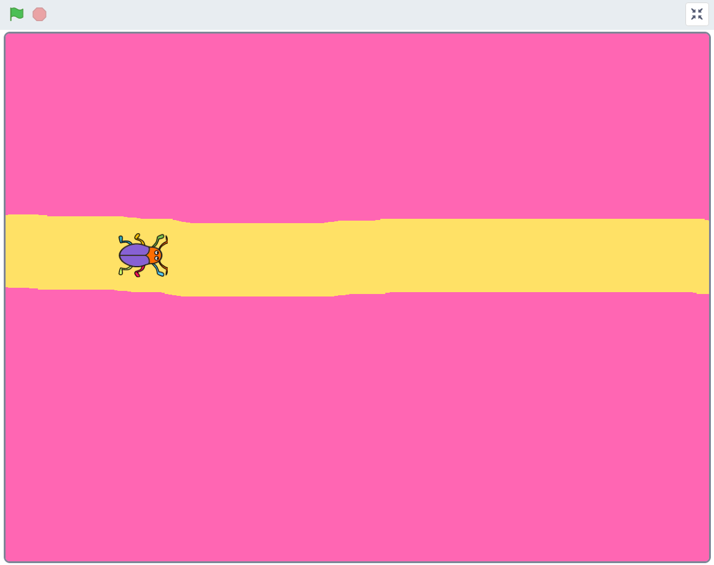
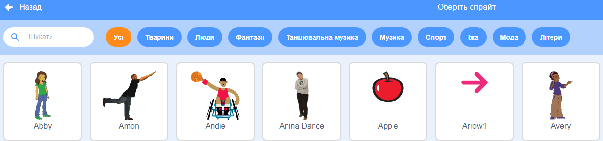
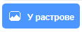
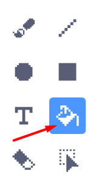
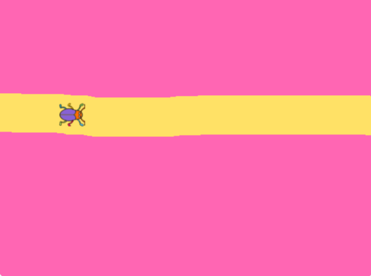
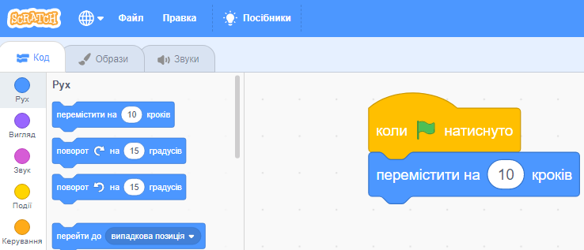
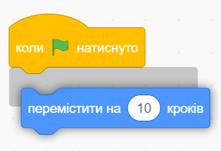

# ПОЧНІТЬ КОДУВАТИ ЗА ДОПОМОГОЮ SCRATCH - ВСТУПНЕ ЗАВДАННЯ
**Що це?** У цьому вступному завданні ви, хто новачок у програмуванні та інструменті Scratch, зможете спробувати кілька простих перших кроків програмування.

**Цілі:** додати нову фігуру, розфарбувати фон, закодувати фігуру для переміщення.

**Зразок проекту:** натисніть на зображення, щоб протестувати готовий зразок проекту: 

> **ЯК Я КОДУЮ?** 
 
Дотримуйтеся покрокових інструкцій і кодуйте свій проект в інструменті Scratch.  <a href="https://scratch.mit.edu" target="_blank"> Натисніть тут, щоб відкрити Scratch. </a> 
 
Натисніть **Створити** у верхній частині веб-сторінки Scratch, щоб відкрити інструмент кодування. Якщо у вас є обліковий запис на Scratch, ви можете увійти, а потім також зберегти проект.
     
 

Час почати кодування! Переконайтеся, що Scratch відкрито на одній вкладці у вашому браузері, а цей посібник – на іншій. Або в двох вікнах поруч.
 
 
Натисніть Розділ 1 нижче, щоб продовжити.

## 1: Виберіть нову фігуру спрайту

У Scratch фігури та чоловічки називаються спрайтами. Існує безліч спрайтів, які можна додати у свій проект, які потім можна перемістити в код.

Тут ви бачите кілька прикладів різних спрайтів.  
     
 

**Час замінювати спрайт кота:** ми починаємо із заміни спрайта кота новою фігурою спрайту - наприклад, жука!
 

Нижче ви можете переглянути відео, як це зробити. Під відео також є текст, який описує, як це зробити крок за кроком.

>**ЩО Я ПОВИНЕН ЗРОБИТИ?**

Подивіться у відео вище, як:
- Видаліть фігурку кота з проекту
- Виберіть нову фігуру спрайту (наприклад, жука)
- Зменшіть розмір спрайту

 
>**ПОКРОКОВА ІНСТРУКЦІЯ:**

Переконайтеся, що ви натиснули «Створити в Scratch», щоб відкрити інструмент «Scratch», тож ви готові створити свій проект. По-перше, ми збираємося замінити кота іншою фігуркою спрайту. Зробити це:

**Видаліть кота та виберіть новий спрайт**

1. У проекті є дві однакові фігурки кота - велика і маленька. Великий стоїть на білій сцені (сцена), а малюнок маленького кота в ящику під сценою. На фігурці маленького кота — корзина. Натисніть на корзину, і спрайт кота буде видалено з проекту. Сцена стає абсолютно порожньою.

     

2. Тепер ми збираємося додати нову фігуру спрайту. Праворуч під сценою є синя кнопка з обличчям білого кота. Кнопка називається Вибрати спрайт. Натисніть її.

    

3. Тепер ви заходите у велику бібліотеку спрайтів Scratch. Тут є багато спрайтів на вибір. Натисніть потрібний спрайт, і він буде доданий до вашого проекту та розміщений на сцені.

    

>**Порада!** У меню бібліотеки спрайтів у верхній частині є різні категорії, які ви можете вибрати, щоб полегшити пошук потрібного вам спрайту, наприклад категорія «Тварини» або «Їжа». Також є функція пошуку.

**Зменшіть розмір спрайту**

4. Спрайт, який ви щойно додали, досить великий, тому ви можете зменшити його розмір. Під сценою, де знаходиться спрайт, ви знайдете заголовок Size (Розмір) - 100. Це означає, що спрайт має повний розмір, тобто 100%. Змініть число на менший відсоток, наприклад 50. Ви завжди можете змінити його пізніше, якщо воно було занадто великим або малим.

    

**Наступний крок:**
Тепер у нас є спрайт. Але для роботи потрібен фон! Час намалювати фонове зображення з дорогою.

Перейдіть до розділу 2.

## 2: Намалюйте фон
Тепер ми намалюємо фон із доріжкою, по якій буде бігати спрайт.

>**ЩО Я ПОВИНЕН ЗРОБИТИ?**

- Активуйте фон
- Увімкніть Bitmap режим в інструменті малювання
- Виберіть колір і інструмент для заповнення фону
- Виберіть новий колір і інструменти, щоб намалювати дорогу

 
>**ПОКРОКОВА ІНСТРУКЦІЯ:**

Біле поле позаду вашого спрайту називається Сценою. Ми можемо змінити фон на сцені, або додавши готове зображення з фонової бібліотеки Scratch, або намалювавши власний фон. Тепер ми намалюємо фон з дорогою. Зробити це:

**Активуйте фон і інструмент малювання**

1. На даний момент спрайт активований, оскільки ми з ним працювали. Щоб працювати з фоном, ми повинні активувати фон. Клацніть на маленьке біле поле далеко внизу праворуч біля напису СЦЕНА. Потім маленьке біле поле позначається синьою рамкою, і фон активується.

    

2. Щоб відкрити інструмент малювання фону, клацніть вкладку під назвою «ФОНИ», розташовану у верхньому лівому куті Scratch.

	  

3. Спочатку натисніть синю кнопку внизу під монтажною областю з написом «Увімкнути растрове зображення». Це значно полегшить малювання.

    
    
**Виберіть колір та інструмент і заповніть фон**

4. Виберіть новий колір для фону, клацнувши маленьке кольорове поле над інструментами. Тепер з’явиться панель вибору кольорів, і ви можете перетягувати білі кружечки в ній, доки не отримаєте потрібний колір.

   
    
5. Тепер клацніть на інструменті, схожому на ВІДРО. Потім клацніть біле поле поруч із відерцем, і весь фон буде заповнено вашим новим кольором.

  
  
**Виберіть новий інструмент і колір і розфарбуйте дорогу**

6. Тепер ми намалюємо шлях на фоні, по якому спрайт зможе бігати. Клацніть на інструмент, схожий на ПЕНЗЛИК. Потім натисніть на цифру 10, яка знаходиться над поверхнею малювання, і змініть розмір пензля на 100 - це буде відповідна ширина для дороги. Потім виберіть новий колір за допомогою палітри кольорів.

 
 
7. Тепер пензлем і новим кольором намалюйте прямий контур на поверхні малювання. Лінія повинна бути досить товстою, щоб спрайт міг поміститися на дорозі.

  

**Наступний крок:**

Тепер у нас є спрайт і фон. Час починати кодувати, щоб спрайт міг рухатися!

Натисніть Розділ 3 і рухайтеся далі.

## 3: Спрайт рухається
За допомогою коду ми можемо контролювати спрайт і проект (напрямок). Насправді спрайти — це просто нерухоме зображення. Спрайт має бути закодований інструкціями, щоб він міг пересуватися по сцені. Код контролює, як має рухатися спрайт і коли він має почати рух. Ви створюєте код за допомогою маленьких шматочків коду, які ви бачите ліворуч у Scratch. Код об’єднується у так званий скрипт і розміщується у великій білій області скрипту посередині Scratch.
 
Час для кодування руху спрайту!

>**ЩО Я ПОВИНЕН ЗРОБИТИ?**

- Активуйте спрайт і поверніться до коду
- Вставте код для стартового блоку: коли натиснуто ЗЕЛЕНИЙ ПРАПОРЕЦЬ
- Введіть код для РУХУ: пройдіть 10 кроків
- Вставте код для CONTROL: назавжди (цикл)

 
>**ПОКРОКОВА ІНСТРУКЦІЯ**

**Кнопка запуску та зупинки**

Ви помітили кнопки START і STOP для проекту над сценою спрайтів? Зелений прапорець — це кнопка запуску, а червоний — кнопка зупинки.

  

Тепер вам потрібно закодувати так, щоб ваш спрайт почав рухатися, коли ви натискаєте кнопку СТАРТ, тобто зелений прапорець над сценою.

**Активуйте спрайт і поверніться до інструменту коду**

1. Ми намалювали інструмент для малювання фону. Щоб закрити інструмент малювання, клацніть вкладку під назвою КОД у верхньому лівому куті Scratch. Потім також клацніть маленьке зображення вашого спрайту, щоб активувати спрайт замість фону.

Тепер ви готові почати кодувати свій спрайт.

**Вставте блок коду для початку**

2. Далеко ліворуч ви знайдете різні кольорові теми із заголовками, напр. Рух і зовнішній вигляд. Якщо натиснути на різні теми, з’являться кілька блоків коду у вигляді шматочків пазла. Вибрана тема та відповідний блок коду мають однаковий колір.

Спочатку клацніть жовту тему під назвою ПОДІЇ та виберіть блок коду із зеленим прапорцем під назвою: «коли натиснуто ЗЕЛЕНИЙ ПРАПОРЕЦЬ». Візьміть блок коду, перетягніть його праворуч і опустіть блок на велику білу область скрипту в центрі Scratch.

  
  
Тепер ви ввели так званий стартовий блок у вашому проекті. Стартовий блок завжди розташований у верхній частині коду, який ви хочете створити. Але потрібно більше коду, щоб спрайт знав, що робити, коли натиснуто зелений прапорець. Ми продовжуємо кодувати.

**Вставити блок коду для руху**

3. Натисніть на синю тему під назвою РУХ і виберіть блок «пройти 10 кроків». Перетягніть блок на поверхню скрипту та прикріпіть його під жовтим блоком коду із зеленим прапорцем. З'єднайте блоки, як дві частини головоломки.

  

 >**Порада!** Якщо наблизити два блоки один до одного на поверхні скрипту, буде видно сіру тінь. Потім ви можете відпустити блок коду, який ви тримаєте, і блоки автоматично з’єднаються, як шматочки пазла.

 

>**Перевірте код!** Перевірте, що відбувається, коли ви натискаєте кнопку СТАРТ (зелений прапорець над сценою). Чи рухається спрайт трохи праворуч, коли ви натискаєте кнопку «Пуск»? Спробуйте більше разів, що вийде?

**Повторіть код руху за допомогою циклу**

4. Ми хочемо, щоб спрайт рухався вперед весь час після того, як ми натиснули кнопку запуску. Нам потрібно додати блок коду, який повторює рух вперед знову і знову - отже, цикл у коді. Зробити це:

Натисніть на помаранчеву тему під назвою CONTROL. Тут ви знайдете кодовий блок під назвою «назавжди». Цей блок може повторювати код, який міститься в ньому, тобто цикл, який змушує код повторюватися знову і знову.

Перетягніть петлю «назавжди» в область скрипту та розмістіть її безпосередньо під «коли натиснуто ЗЕЛЕНИЙ ПРАПОРЕЦЬ», щоб синій блок руху «пройти 10 кроків» знаходився всередині петлі. Тоді це виглядає як на малюнку нижче:

  

>**Перевірте код!** Натисніть прапор START для проекту. Тепер спрайт, який тікає, набирає швидкість.

**Зупиніть код і втягніть спрайт**

5. Спрайт зупиняється на краю. Візьміть спрайт і знову перетягніть його на сцену. Спрайт знову втікає? Ви повинні натиснути червону кнопку зупинки над сценою, щоб зупинити код, і спрайт припинить роботу.

  

>**Порада!** Спрайт рухається занадто швидко? Ви можете змінити швидкість, написавши меншу цифру в синьому блоці коду під назвою go 10 steps («пройти 10 кроків»). Клацніть на цифру 10 у блоці та напишіть, наприклад, 3. Запустіть проект знову – чи достатньо швидко зараз працює спрайт? Випробуйте свій шлях, поки не будете задоволені швидкістю.

 

**Наступний крок:**
Тепер у нас є спрайт, що біжить по дорозі. Але лишається на краю. Час зайняти вихідне положення.

Натисніть Розділ 4, щоб продовжити.

## 4: Встановіть початкову позицію
Щоб не відтягувати жука щоразу, коли ви починаєте гру, ви можете закодувати спрайт так, щоб він завжди починався з певного місця на сцені. Для цього ми використовуємо координати x і y спрайту.

>**ЩО Я ПОВИНЕН ЗРОБИТИ?**

- Перетягніть спрайт у те місце на дорозі, де ви хочете, щоб він почався
- Вставте блок коду для позиції з РУХОМ: перейдіть до x:__ y:__

 
>**ПОКРОКОВА ІНСТРУКЦІЯ:**

**Додати блок коду для початкової позиції**

1. Перетягніть спрайт у положення, звідки ви хочете, щоб він почав рух. 

2. Натисніть на тему  **РУХ** ліворуч і виберіть блок **"перейти до x:__ y:__"**. Розмістіть блок коду в сценарії безпосередньо під жовтим блоком під назвою **"коли натискається ЗЕЛЕНИЙ ПРАПОРЕЦЬ"**. Числа (значення), які з’являються в блоці під X і Y, є **координатами** положення, куди ви помістили жука, тобто конкретного місця на сцені.

  

Тепер жук займатиме ту саму вихідну позицію кожного разу, коли ви натискатимете зелений прапорець СТАРТ над сценою.

>**Перевірте код!** Протестуйте свій проект і запустіть код. Чи починається спрайт з того самого місця кожного разу, коли ви натискаєте зелений прапорець старту? Чи досить швидко він рухається?

**Гарна робота! Тепер ви створили свій перший проект у Scratch і закодували свою першу програму, яка керує рухом спрайту.**

## Готово!
Щиро вітаю! Тепер ви вивчили основи Scratch і можете братися за трохи більші проекти!

## Питання 

* Що таке спрайт?

* Що таке петля?

* Що таке скрипт?
